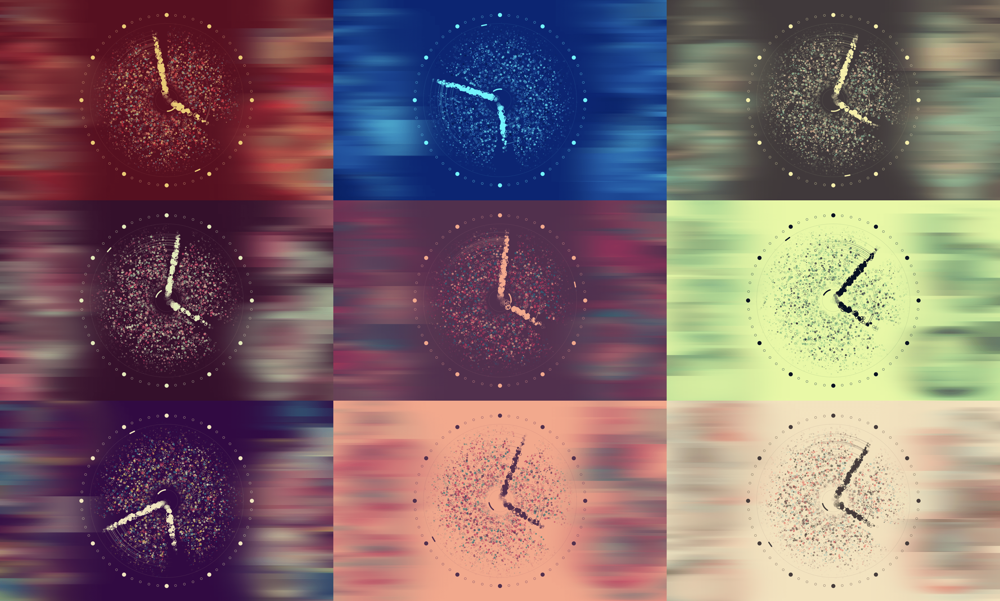

# Flutter Particle Clock

For my entry in the [Flutter Clock Challenge](https://flutter.dev/clock) I wanted to build something colorful, animated and playful that changes appearance with time. Ideally, I wanted it to look different every time I looked at it. I also wanted to explore the custom painting features of Flutter. 👨‍🎨

I ended up with an analog watch face featuring a simple particle system. It randomizes the color palettes while also maintaining legibility by calculating the luminance in real-time.

Building this was a bit of a struggle as I'm not very good with math, but the framework and the developer experience (hot reload, in particular) helped me out a lot. Being able to iterate quickly is a great way to learn new things. I guess the code could be improved in several ways, both in terms of elegance and performance. However, I've managed to easily stay far below the 16ms/frame benchmark (average 5ms/frame on my iPad while debugging). Flutter's rendering engine performs fantastically, even with my horrible math! 😅

**Visit [Ultimate Machine](https://ultimatemachine.se/articles/how-i-created-a-particle-clock-and-won-the-flutterclock-challenge/) for a detailed write-up on how this was built.**

## Highlights

  - 🎨 Randomly selects color palettes while still maintaining legibility at all times.
  - 🌤 Supports both **light mode** and **dark mode**, by filtering background color by luminance.
  - 📱 Scales to fit the screen space available and adjust calculations & rendering accordingly.
  - 🚀 At least 60 FPS on modern devices.
  - 🌈 Constantly shifting and moving, making it fun to look at.
  
## Preview

  

   
  🎬 <a href="https://twitter.com/Miickel/status/1219311659984080897">Watch it in action on Twitter</a> 🎬

## License

MIT License

Copyright (c) Mickel Andersson <mickel@ultimatemachine.se> (ultimatemachine.se & tayl.app)

Permission is hereby granted, free of charge, to any person obtaining a copy of this software and associated documentation files (the "Software"), to deal in the Software without restriction, including without limitation the rights to use, copy, modify, merge, publish, distribute, sublicense, and/or sell copies of the Software, and to permit persons to whom the Software is furnished to do so, subject to the following conditions:

The above copyright notice and this permission notice shall be included in all copies or substantial portions of the Software.

THE SOFTWARE IS PROVIDED "AS IS", WITHOUT WARRANTY OF ANY KIND, EXPRESS OR IMPLIED, INCLUDING BUT NOT LIMITED TO THE WARRANTIES OF MERCHANTABILITY, FITNESS FOR A PARTICULAR PURPOSE AND NONINFRINGEMENT. IN NO EVENT SHALL THE AUTHORS OR COPYRIGHT HOLDERS BE LIABLE FOR ANY CLAIM, DAMAGES OR OTHER LIABILITY, WHETHER IN AN ACTION OF CONTRACT, TORT OR OTHERWISE, ARISING FROM, OUT OF OR IN CONNECTION WITH THE SOFTWARE OR THE USE OR OTHER DEALINGS IN THE SOFTWARE.
